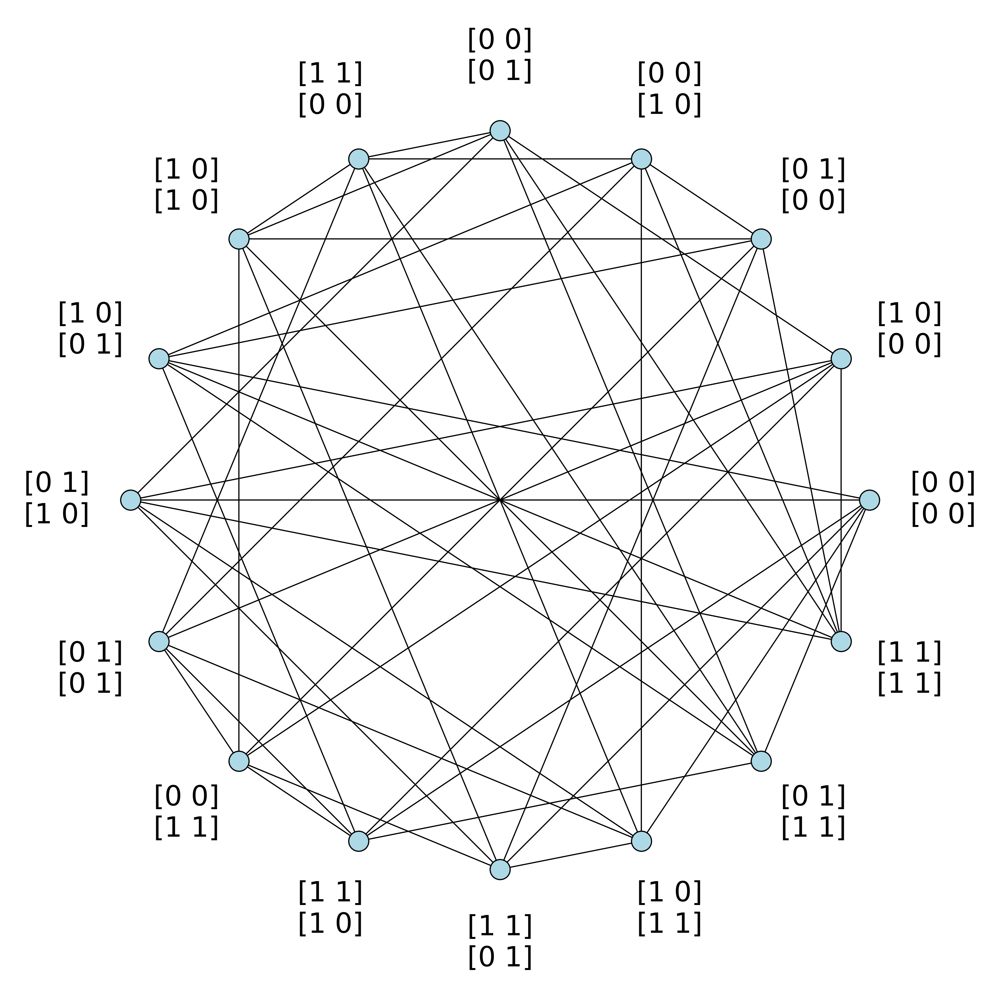

# Gcd-graphs over matrix rings

This repository contains the code and computational experiments for the paper **"On gcd-graphs over matrix rings"**.

The code is written in SageMath notebooks and is used to:
- construct gcd-graphs over matrix rings $M_n(\mathbb{F}_q)$,
- and validate matrix decomposition techniques in the paper.

---

## 1) Preliminaries
Let $R$ be a finite ring and $S \subset R \setminus \{0\}$ be a symmetric subset (meaning that $S=-S$). The Cayley graph $\Gamma(R,S)$ is defined as follows:

- The vertex set is the set of elements in $R$.
- Two vertices $x, y \in R$ are adjacent if $x - y \in S$.

We refer to $S$ as the generating set for $\Gamma(R,S)$.

Let

$$
R = M_n(\mathbb{F}_q),
$$

and for each $1 \le k \le n$, define

$$
V_k = \{ A \in M_n(\mathbb{F}_q) \mid \operatorname{rank}(A)=k \}.
$$

For a set of ranks $I \subseteq \{1,\dots,n\}$, define the generating set

$$
S = \bigcup_{k \in I} V_k.
$$

The gcd-graph is the Cayley graph

$$
\Gamma\!\left(M_n(\mathbb{F}_q), S\right),
$$

with:
- vertex set: all matrices in $M_n(\mathbb{F}_q)$,
- adjacency: $A$ and $B$ are adjacent iff $\operatorname{rank}(A-B) \in I$.

---

## 2) Graph Construction (`graph_construction.ipynb`)

From the definition outlined above, the core constructor is:

```python
def gcd_graph(n: int, q: int, S: list[int]) -> nx.Graph:
    '''
    Construct gcd-graph defined on M_n(F_q)
    Args:
    n (int): dimension of matrices
    q (int): order of the finite field F_q
    S (list[int]): list of ranks k in generating set S
    Returns:
    The gcd-graph as a nx.Graph instance
    '''
    F = GF(q)
    MS = MatrixSpace(F, n)
    matrices = list(MS)
    for m in matrices:
        m.set_immutable()
    G = nx.Graph()
    G.add_nodes_from(matrices)
    cardinality = len(matrices)
    for i in range(cardinality):
        for j in range(i+1, cardinality):
            A = matrices[i]
            B = matrices[j]
            if int((A-B).rank()) in S:
                G.add_edge(matrices[i], matrices[j])
    return G
```

For example, the notebook includes

```python
G = gcd_graph(2, 2, [2])
```

which constructs $\Gamma(M_2(\mathbb{F}_2), V_2)$, and saves the plotted graph as `m2f2_2.png`.



---

## 3) Matrix Decomposition Experiments (`matrix_decomposition.ipynb`)

The notebook implements the matrix decomposition techniques described in `Lemma 3.6`, `Lemma 3.9`, and `Theorem 3.11` from the paper. The following function constructs matrices $X_m, X_k \in M_n(\mathbb{F}_q)$ such that:

$$
\operatorname{rank}(X_m)=m,\quad
\operatorname{rank}(X_k)=k,\quad
X_m + X_k = I_n(r),
$$

```python
def decompose(q: int, n:int, r:int, m:int, k:int):
    '''
    Express I_n(r) in M_n(F_q) as a matrix with rank m and a matrix with rank k
    Args:
    q (int): order of the finite field F_q
    n (int): dimension of matrices
    m (int): rank of the first matrix X_m
    k (int): rank of the second matrix X_k
    Returns:
    Matrices X_m, X_k, as SageMath Matrix instances
    '''
    F = GF(q)
    if m < k:
        m, k = k, m
    if r <= m: # Lemma 3.6
        if q == 2:
            if m > k:
                xm = I(F, n, m)
                for i in range(1, r-m+k+1): xm += E(F, n, i, i+1)
                xk = I(F, n, r) - xm
            if m == k:
                xm = xk = matrix(F, n, n)
                if r == 1 and m == 1:
                    xm += E(F, n, 1, 1) + E(F, n, 1, 2)
                    xk += E(F, n, 1, 2)
                else: # r < m or r == m >= 2
                    for i in range(1, m): xm += E(F, n, i, i+1)
                    xm += E(F, n, m, 1)
                    if r == m: xm += E(F, n, m, 2)
                    xk = I(F, n, r) - xm
        else:
            h = [x for x in F if x != F(0) and x != F(1)][0]
            d1 = ([1] * (m-k)) + ([1-h] * (r+k-m)) + ([1] * (m-r))
            d2 = ([0] * (m-k)) + ([h] * (r+k-m)) + ([-1] * (m-r))
            xm = diag(F, n, d1)
            xk = diag(F, n, d2)
    else: # r > m, Lemma 3.9
        if q == 2:
            u = matrix(F, n, n)
            for i in range(1, m+k-r+1): u += E(F, n, i, i+1)
            xm = I(F, n, m) - u
            xk = u
            for i in range(m+1, r+1): xk += E(F, n, i, i)
        else:
            h = [x for x in F if x != F(0) and x != F(1)][0]
            d1 = ([1] * (r-k)) + ([1-h] * (m+k-r))
            d2 = ([0] * (r-k)) + ([h] * (m+k-r)) + ([1] * (r-m))
            xm = diag(F, n, d1)
            xk = diag(F, n, d2)
    return xm, xk
```

To validate `Theorem 3.11`, the notebook runs a full sweep over:
- $n = 2,3,4,5$,
- $q \in \{2,3,4,5\}$,
- all valid triples $(r,m,k)$ in the tested ranges.

All tested cases passed.

---

Please send any feedback/suggestion to Dung Nguyen (<dnguy9448@365.elmhurst.edu>) 